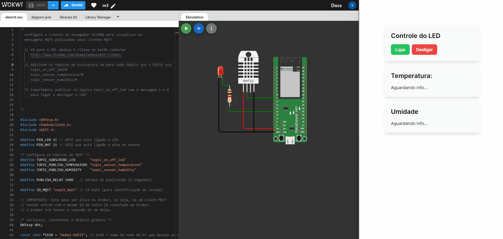

# Atividade do M3 de IoT

Projeto simples que conecta em um micro controlador por rede e exibe as informações de temperatura e umidade.
A interface gráfica comunica o micro controlador para ativar uma luz de led

## Funcionamento

Interface + micro controlador

## PROJETO

<ul>
  <li><b>projeto Wokwi:</b> https://wokwi.com/projects/380569957457195009</li>
</ul>
